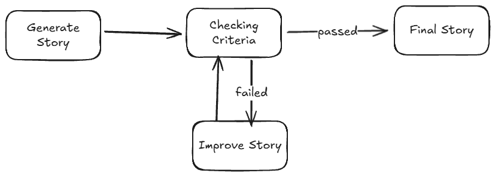

# prompt chaining

## Definition
multiple prompt are sequence to guide model processing task. prompt chaining can manage step to improve accuracy

## Example

Checking criteria step to make sure our story passed the criteria