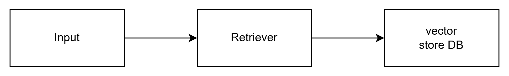

# Agentic AI with Krish Naik

This repository to help me to understand and practic Agentic AI with Krish Naik in Udemy (Complete Agentic AI Bootcamp with LangGraph and Langchain)

## RAG (Retrieval Augmentation Generation)

Data Ingestion:

- Raw data (PDF, video, csv, json)
- Split raw data to text chunk
- Embedding the text chunk
- Store in vector database (FAISS, CHROMADB, ASTRA DB)

Retrieval Chain to help AI query vector DB to add context in Gen AI

Deployment can do with Langserver

## Agentic AI vs AI Agents

- AI Agents = Individual AI automatic perform solve specific task without human intervention with predefined rules. Example : Customer Chat Bot

    example:
    - Automated Banking Bots : Balance inquieries, transactions (The task is clear)

- Agentic AI = multiple AI agents collabolarate with broader framework to achieve goals and learning from experience rather than just following predifined rules. 

    example:
    - Smart Home system to reduce electricity.
    - Personalized Health Assistance : analyze medical history, real-time health data and lifestyle to provide personalized care recommendation. They have ability to adapt to new medical research and patient feedback to improve the performance.

    Perception : Gather data from surrounding
    Reasoning : Understand what going on
    Action : take a specific action
    Learning : adapt and improve based on the current condition

- Agentic AI to develop the Application:
    - Requirement gathering (AI agent 1)
    - Sprint planning [Agile Process]
    - Development process (AI agent 2)
    - Testing (AI agent 3)
    - Feedback testing
    - Code review (AI agent 4)

## LangGraph

Library to create multi-agent workflow. Inspired from Pregel and Apache Beam.

Trusted by Linkedin, Uber, Klarna and GitLab

**memory** 
support memory of conversation
**human in the loop**
add human feedback in the loop

can build DAG in Agent workflow

component : Node and Edge

